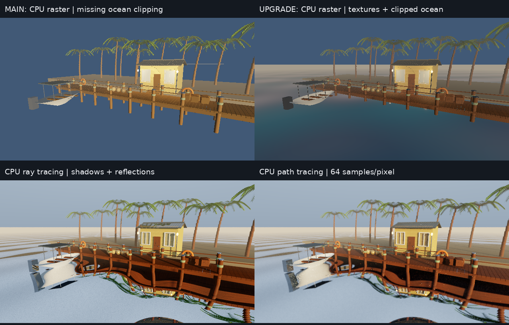
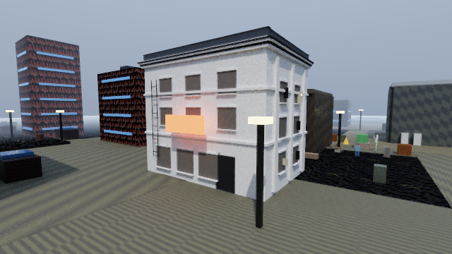

# CPU upgrade: measured validation

Validated on 2026-10-05 in a shared Linux cloud workspace: 9 available CPU cores,
9.7 GiB RAM, GCC 14.2, C++17 Release (`-O3 -DNDEBUG`). No physical GPU or audio
device was used. CPU runs use SDL2 2.32.10 and dummy video/audio drivers; preserved
OpenGL checks use system SDL2 2.32.4 with Mesa llvmpipe/LLVM 19.1.7 offscreen.

[Machine-readable results and provenance](validation/cpu-upgrade/summary.json)
include exact source fingerprints and complete frame-time summaries.

## Actual framebuffer comparison



All four panels come from Fury's runtime framebuffer, with the same scene,
camera and 640×360 dimensions. They are not Blender renders or generated artwork.
The old rasterizer drops the ocean when a corner crosses behind the camera;
proper clipping restores it. The tracing panels show actual scene reflections
and shadow rays. The path capture accumulates 16 frames × 4 samples = 64 spp.

## Timing observations

All benchmark application runs were serialized. The host is shared, so repeat
runs vary. Most cases use 35 frames, five warmup frames and 29 measured frames;
the final capture frame is excluded. Path tracing uses 16 frames, two warmups,
13 measured frames, four spp/frame and six bounces.

| Same 640×360 Coastal input | Median wall ms | p95 ms | Workers |
|---|---:|---:|---:|
| Main `40cc679` software raster | 89.98 | 120.31 | 1 |
| Upgraded per-pixel software raster | 123.45 | 132.30 | 1 |
| CPU ray mode, one spp/frame | 228.59 | 340.68 | 4 |
| CPU path mode, four spp/frame | 1539.57 | 2744.18 | 4 |
| Preserved OpenGL via **CPU llvmpipe** | 19.76 | 55.96 | Driver-managed |

The richer raster path costs about 37% more median time in this final run. Its
visible work is also different because the old path loses the ocean. This is a
correctness/fidelity upgrade, not evidence of a universal speedup. OpenGL through
llvmpipe is the fastest tested interactive route here; strict software presentation
remains useful where GL is unavailable. CPU path tracing is a progressive preview,
not a 60/120 fps promise. Performance on a user's hardware must be measured there.

The CPU tracer reports 119,614 nondegenerate submitted triangles, shared mesh BVHs,
and **one TLAS build** across the static run. Raster reports 119,870 submitted
source triangles; the tracer omits 256 degenerate primitive-pole triangles. The
motion/deformation/resize case completes eight frames, rebuilds the changed
hierarchy, resets accumulation and ends at 240×135 with zero validation errors.

## Actual gameplay integration



This is the game scene, with 729,290 submitted nondegenerate triangles. The
storefront replaces Bldg3's box visual while preserving its original collision
AABB. Photo mode freezes geometry, lighting and animation time; the capture
reaches **16 accumulated frames / 64 spp**, with zero validation errors. Its last
CPU frame was about 2299 ms in this run. Most surrounding buildings, textures and
foliage remain visibly prototype-grade; the image is evidence, not an AAA claim.

The game also completes bounded software-raster and offscreen OpenGL runs with
CPU audio selected. The OpenGL path retains its GPU/driver route and corrected
nonuniform-scale normals; llvmpipe was actually used for this local check.

## Tests and review

- Full Release build and **9/9 CTest suites passed**: rendering math, glTF import,
  settings, CPU audio, software pixels, all-asset production import, CPU rays,
  CPU Renderlab and CPU Vaultline runtimes
- Focused ASan/UBSan checks passed for raster, rays, audio and texture/glTF logic;
  raster/rays also exercised float-cast-overflow checks. LeakSanitizer cannot run
  under this executor's ptrace and was disabled, not claimed as passed
- Independent review reproduced and fixed Windows SDL entry-point linkage,
  unsupported debug-view cycling, mirrored single-sided visibility and glass
  entry/exit normals. The SDL entry macro now produces the expected C symbol
- Mutation testing proves the oblique-glass regression fails when exit-face
  culling is deliberately broken
- **178/178 runtime model previews passed**: 44 GLBs + 42 OBJs from opposing
  viewpoints, plus six exact-gameplay-filtered vehicle LOD closeups. See the
  [visual review](ASSET_VISUAL_REVIEW.md) and [structural inventory](ASSET_AUDIT.md)

### Audio proof

Both the SDL2-only path and optional **SDL_mixer 2.8.1** path were built and tested.
The latter was also integrated through CMake's static imported target; actual
postmix PCM, mute/gain and lifecycle tests passed. Original authored WAVs remain.

The reproducible eight-second offline mix is 48 kHz stereo PCM16, 384,000 frames,
peak 0.8303, RMS 0.1592 and **zero saturated samples**. Its hash and format are in
the summary JSON. Generate/listen to it with:

```sh
./build/tests/fury_audio_tests --write-wav out/cpu-audio.wav
```

Dummy callbacks and offline nonzero PCM establish functioning CPU synthesis and
mixing. Physical speaker routing, latency and subjective sound quality were not
verified on this cloud machine.

## Remaining checks and limits

Windows builds/CI and DX12 hardware execution are separate from these local Linux
results; consult the draft PR's checks for their current state. A compiling DX12
backend is not a measured hardware-DXR result. Vendor-upscaler quality/performance,
physical audio, long gameplay soak tests and broad hardware coverage remain.

The current game is still a vertical-slice prototype. Clearcoat/specular/sheen/
anisotropy extensions, high-resolution authored PBR textures, richer animation,
production networking and complete game content are not delivered by this patch.
See [the implementation and limits](CPU_RENDERING.md) for precise renderer scope.
