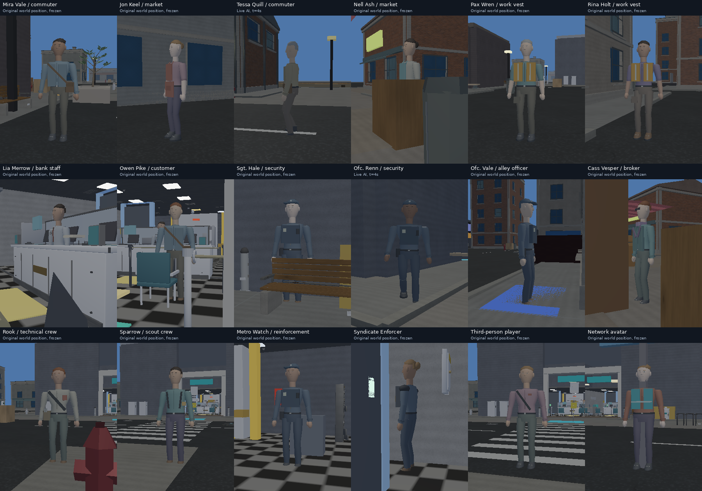
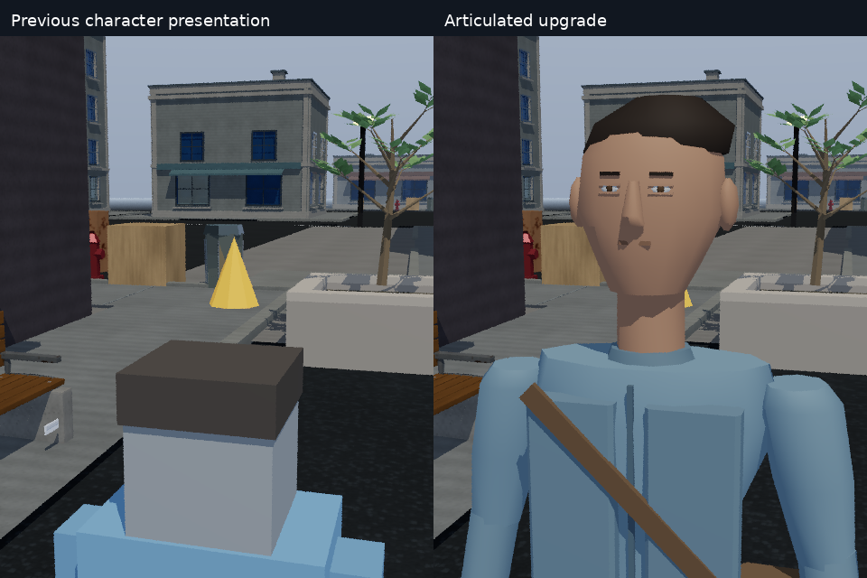

# NPC population: runtime evidence and validation

Validated on **2026-10-05**, Linux x86-64 cloud, **9 logical CPUs / 9.7 GiB RAM**.
Rendering workers were capped at two for CPU rays. No physical GPU, Windows DXR
runtime or speaker hardware was available. This report covers the new NPC
increment; [whole-world](WORLD_VALIDATION.md), [materials](SURFACE_VALIDATION.md)
and [CPU audio](CPU_AUDIO.md) reports remain separate evidence for earlier work.

## Full population and actual movement

**18 possible actor IDs, 11 wardrobe roles, 16 normal-startup actors.** The new
production population totals **36,808 near / 17,204 far triangles** at startup.
Maximum tested single model: **2,464 near / 1,120 far triangles**. Two dynamic
roles are captured through their real spawn helpers, without changing their
normal gameplay trigger conditions.

[Full population before](images/npc-upgrade/population-before.png) ·
[Full population after](images/npc-upgrade/population-after.png)



Each cell is a lossless game framebuffer capture at a real world location. Sixteen
are frozen inspection views; Tessa and Renn are shown after **four simulated
seconds of live AI** so their inherited starting obstruction is not hidden or
removed. Cameras orbit the original actor positions; models are never moved to
an artificial display stage. Furniture, counters, traffic, buildings and other
NPCs remain visible and can occlude actors.

**Four paired motion videos**, 960×408, 48 frames / 4 simulated seconds each:

- [Mira walking and turning](videos/npc-upgrade/comparison-mira.mp4)
- [Alley officer patrol](videos/npc-upgrade/comparison-officer.mp4)
- [Tessa street movement](videos/npc-upgrade/comparison-tessa.mp4)
- [Rook idle and attention gesture](videos/npc-upgrade/comparison-rook-talk.mp4)

These are actual rendered frame sequences at **12 fps of simulated time**,
encoded without interpolated frames. They are not a claim of 12 fps live
performance. Rook's clip invokes the **presentation gesture**, not a synthetic Q
keypress, voiced dialogue or active-heist following. Real crew follow behavior
and dialogue selection/content are tested independently.

**Nine larger CPU-ray comparison pairs**, 480×600 per side, two frames, two
samples/frame and a two-bounce cap:

[Mira full body](images/npc-upgrade/comparison-mira.png) ·
[Mira face](images/npc-upgrade/comparison-mira-face.png) ·
[Work vest](images/npc-upgrade/comparison-dock.png) ·
[Bank staff](images/npc-upgrade/comparison-teller.png) ·
[Rook](images/npc-upgrade/comparison-rook.png) ·
[Sparrow](images/npc-upgrade/comparison-sparrow.png) ·
[Reinforcement](images/npc-upgrade/comparison-guard.png) ·
[Fence](images/npc-upgrade/comparison-fence.png) ·
[Enforcer](images/npc-upgrade/comparison-enforcer.png)



The evidence generator completed **62 actual game launches / 31 matched pairs**.
All paired **real NPC/crew/heist state sidecars match exactly**. This includes
36 population views, 18 ray portraits and eight source motion sequences. The
comparison switch changes presentation only; corrected gameplay runs on both
sides. [Raw capture manifest](validation/npc-upgrade/capture-manifest.json)
includes commands, executable hash, source fingerprint, framebuffer hashes,
actual actor state, geometry/work counters and renderer measurements.

## Regression and gameplay results

| Configuration | Result |
| --- | --- |
| System SDL2 + actual offscreen Mesa llvmpipe OpenGL | **32/32 suites pass** |
| GL-free SDL2 build + dummy video/audio | **29 pass, 3 explicit GL skips, 0 failures** |
| Production NPC runtime regression | **38 isolated launches, 22 captures, 16 invalid-input rejections** |
| Model geometry / identity / LOD population | **704 combinations pass** |
| Animation / stopping support | **14,460 gait poses + 6,000 stopping samples pass** |
| Actual production roster / controllers | **780,461 per-frame predicates pass** |
| Presentation ownership / LOD / finite guards | **5,665 checks pass** |
| Skinning through Software / CPU-ray / OpenGL | **66 role/LOD/backend cases + 9 cadence schedules pass** |
| HLSL compilation | **All 8 entries pass, official DXC 1.9.2609.5, shader model 6.5** |

Predicate counts are not claims of hundreds of thousands of distinct scenarios.
The complete suite includes the existing raster, ray/path, audio, imported asset,
world, water, material, settings and visibility regressions. Focused model,
animation, locomotion, presentation and gameplay tests additionally passed
ASan/UBSan. LeakSanitizer was unavailable under the executor's tracing.

[CPU CTest output](validation/npc-upgrade/npc-tests-final-cpu.txt) ·
[System/GL CTest output](validation/npc-upgrade/npc-tests-final-gl.txt) ·
[Runtime test report](validation/npc-upgrade/npc-runtime-summary.json) ·
[Shader checksums](validation/npc-upgrade/shader-sha256.txt)

Important behavior repairs were verified with deliberately reintroduced defects:

1. Q focus now follows the actual camera axes, while preserving names, dialogue
   text, roles, range, ranking and nameplate fill
2. Badge/terminal bypass and escape synchronize both lockdown state owners
3. Reset restores all five mission-relocated agents from the original roster
4. A security-camera alert no longer teleports the desk guard onto the player;
   guards approach with bounded movement, investigation chase survives the next
   main-loop update, and reset clears stale investigation/escalation
5. Repeated dynamic spawns reuse their same-name entity and cached LOD meshes,
   instead of leaving duplicate visible actors or accumulating unused meshes

The controller integration completes the real approach → breach timer → loot →
escape → payout path, crew travel/boosts, lock-jam pause and failure/reset paths.
It does **not** force network phase values. See [exact gameplay coverage and
mutation tests](NPC_GAMEPLAY_VALIDATION.md). A separate actual executable smoke run
completed its scripted world/cinematic transitions with the SDL2-only **48 kHz,
32-voice stereo CPU audio backend** active through SDL's dummy sink; this is a
callback/software smoke test, not speaker playback or a human UI playthrough.
[Smoke log](validation/npc-upgrade/mission-smoke-cpu-audio.txt)

## Backend execution

All roles and both LODs change/restabilize/restored pixels correctly through
Software, CPU rays and OpenGL. Unchanged poses do not rebuild a CPU-ray BLAS;
changed poses rebuild exactly one actor's geometry. OpenGL consumes the dirty
upload without API errors. [Renderer regression details](CHARACTER_RENDERING.md)

The full application also ran [OpenGL walking](images/npc-upgrade/gl-mira.png),
[OpenGL crew](images/npc-upgrade/gl-rook.png), and an eight-frame
[CPU path-traced moving actor](images/npc-upgrade/path-dock.png). The path run had
**zero validation errors** and correctly reset accumulation to one on movement.
The GL adapter was **CPU llvmpipe**; that backend intentionally disables its
hardware-shadow/reflection path on software adapters. Its full-game timing
telemetry remains unavailable (zero fields), so those values are not benchmarks.
DX12's geometry-revision path was inspected and all shader entries compile, but
Windows C++/DXR execution is **not verified** by these Linux tests.

## Measured CPU cost

The primary timing pass ran **three sequential repetitions** of each matched
old/new presentation case, using Mira's real moving production scene, fixed
1/12-second simulation steps, no framebuffer file output, and fresh isolated
settings/saves. Raster runs used eight frames; CPU rays used four, one
sample/frame and two bounces. Quality also changes cull/fog/FX settings.

| Setting | Previous last-render median | New last-render median | Previous/new complete-run median |
| --- | ---: | ---: | ---: |
| Low, 320×180, raster | 134.1 ms | 127.9 ms | 3.19 / 3.13 s |
| Low, 320×180, CPU ray | 441.5 ms | 276.4 ms | 3.58 / 3.28 s |
| High, 480×360, raster | 363.4 ms | 337.8 ms | 4.78 / 4.93 s |
| High, 480×360, CPU ray | 939.0 ms | 830.8 ms | 5.84 / 6.17 s |

**These observations do not establish a speedup.** Geometry/occlusion changes
alter ray work, and cloud timing noise is substantial. The high-quality complete
run is slightly slower with articulated characters. Software timing spans draw
submission, rasterization and presentation; ray timing spans TLAS/trace/resolve
but excludes earlier BLAS preparation. Both exclude main-loop skinning/gameplay.
The startup-inclusive values include the whole run. No column is a guaranteed
live frame rate, and this machine is far from real-time AAA ray tracing.

[All timing samples and commands](validation/npc-upgrade/benchmark-timing.json)
retain the original observations. Its historical helper had no `/usr/bin/time`,
so empty/zero RSS fields there mean **unavailable**. The separate fresh-parent
Linux RUSAGE_CHILDREN pass below measures actual process memory, with one sample
per setting; it is not used to support performance-speed claims.

| Setting | Previous peak RSS | New peak RSS |
| --- | ---: | ---: |
| Low, 320×180, raster | 147.6 MiB | 153.0 MiB |
| Low, 320×180, ray | 266.4 MiB | 277.8 MiB |
| High, 480×360, raster | 150.5 MiB | 155.9 MiB |
| High, 480×360, ray | 301.0 MiB | 318.1 MiB |

[Raw isolated memory observations](validation/npc-upgrade/memory-recheck.json)


The comparison and resource limits are deliberate: this is an engine/prototype
upgrade with bounded CPU cost, not production AAA human realism. Original flat
terrain, some authored spawn/prop overlaps, waypoint-only navigation, absent
crowd avoidance and intentional mission relocations remain. Faces do not have
mocap, lip-sync or deformable facial expressions; clothing/hair is geometric and
unsimulated. [Full implementation scope and limits](NPC_UPGRADE.md)

## Reproduce and identify the tested code

```sh
./scripts/validate-npcs.sh build
python3 scripts/capture-npc-evidence.py --vaultline build/apps/vaultline/vaultline \
  --output-dir out/npc-evidence-new --phase all --workers 2
python3 scripts/benchmark-npcs.py --vaultline build/apps/vaultline/vaultline \
  --output-dir out/npc-benchmark-new --repeats 3
```

Evidence capture requires Pillow and FFmpeg; the game does not. The capture helper
uses native Linux symlinks for isolated read-only assets. Use a fresh output path.
The runtime regression has a hardlink/copy fallback on other hosts.

- Tested rendering/program source fingerprint:
  `019c811fc4c9a30bc7f1b853096512ffe53d02e0de1608afdd9c894ec1546b25`
- GL-free executable SHA-256:
  `60b796ba4d176d4fe8e7c1194093fcd81506f6922719d675e26b34f4a29c6560`
- System-SDL executable SHA-256:
  `3c77340e3cbcbc4c88c22f13a3f74733f3ebd1b1eff21a69282bb39588b5ed94`
- Final isolated runtime test SHA-256:
  `b3f8e5e7c47877e4df149b15f6a70c550f60a66aab8042c2dc0a9b546ca7e5d0`

Hosted GitHub Actions has not supplied a build for the fork. These are verified
local-cloud results; a CodeRabbit status is not a substitute for build/test CI.
The change remains a draft for manual owner review and merge.
