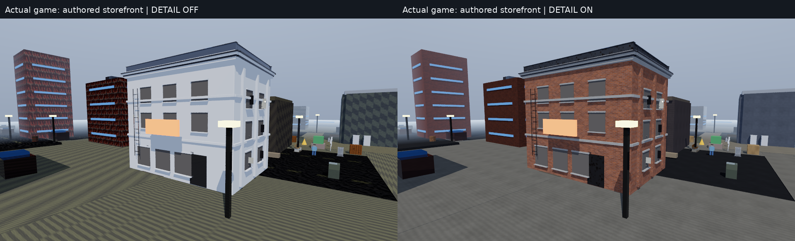
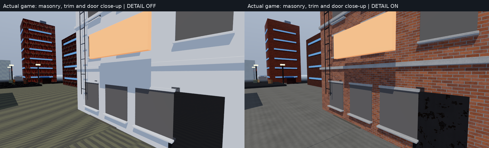
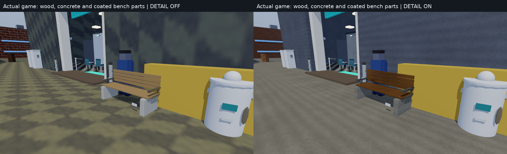
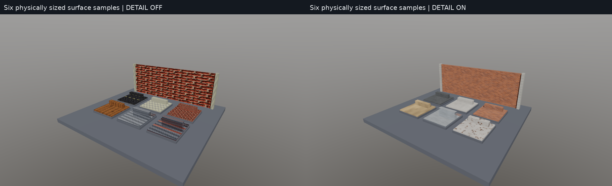
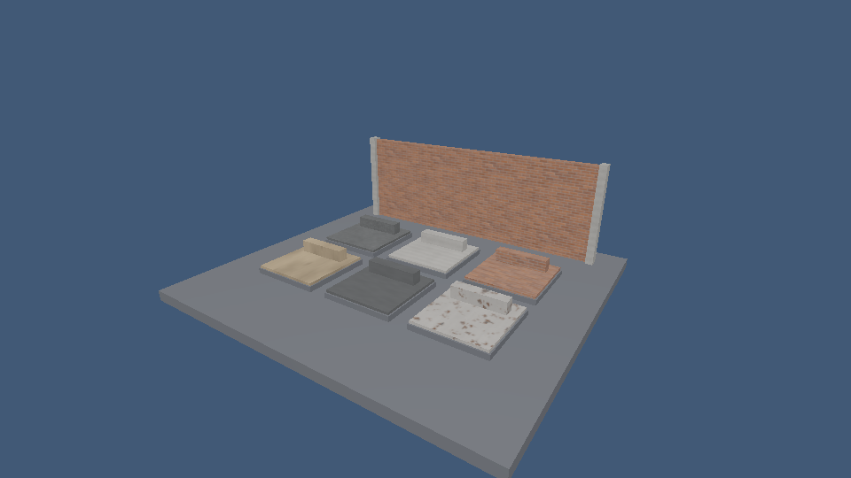

# Runtime surface-detail upgrade and validation

This report records the earlier `b2442f4` material checkpoint. The subsequent
[full playable-world upgrade](WORLD_VALIDATION.md) adds district geometry,
waterfronts, vegetation/props, mapped-water reflections and current validation.

This is the second, bounded visual phase after CPU checkpoint
`bb2d03f863e3db7d7b6bc041b414afbe5c8a91b3`. It improves actual game surfaces and
corrects GPU material handling. Source asset binaries, collision and world
triangle positions remain intact. The game is still a prototype.

## Visible runtime results

All comparisons below are **actual Fury framebuffer captures**, with identical
camera, lighting, resolution and settings except `FURY_SURFACE_DETAIL=0|1`.
They are not Blender renders or image-generated illustrations.



The authored storefront now has physically scaled brick courses and mortar,
concrete trim, timber and coated hardware. The same profile path also improves
legacy street/building surfaces. Normal maps change shading, not geometry or
collision; they do not create true displaced brick silhouettes.





The bench keeps separate wood, concrete, coating and protected branding. Its
wood UVs are baked into runtime copies in **asset-local metres**, following the
longitudinal slat direction at both gameplay yaws. False texture board joints
were removed because the real slat geometry already defines those joints.
White painted window casings stay in their original finish rather than receiving
an inappropriate raw-wood tint.



The neutral gallery demonstrates all six original procedural profiles and their
physical scale. The profiles are asphalt, concrete, brick, wood, brushed metal
and worn coated metal. The maps are 512×512 by default, with correlated albedo,
height-derived tangent normals and packed roughness/metallic channels, plus
complete filtered mip chains. [Actual albedo atlas](images/surface-detail/surface-albedo-atlas.png),
[normal atlas](images/surface-detail/surface-normal-atlas.png),
[wood rotation proof](images/surface-detail/wood-rotation-atlas.png).

These are original deterministic code-generated materials under the repository's
MIT license. No external texture collection was downloaded or silently substituted.
They modulate the source material factors; they are not measured scans or a claim
of a complete production art library.

## Runtime selection and preservation

- Detail is enabled by default; `FURY_SURFACE_DETAIL=0` restores the legacy detail
  path for comparison or lower-cost use
- `FURY_SURFACE_DETAIL_RES=128|256|512` sets map resolution; physical tile size
  remains unchanged. The 128px preset uses less memory, not larger bricks
- Most profiles repeat every 2 m; brushed metal every 1 m. Brick pitches are
  250 mm × approximately 83 mm, with about 8 mm mortar
- The six 512px map sets plus mips hold **25,165,800 bytes**. The additional
  quarter-turned wood set is **4,194,300 bytes**, about 28 MiB together
- The process cache retains one resolution/orientation combination; each renderer
  retains only the profile/orientation sets it uses. A renderer can retain more
  sets if an application deliberately requests more orientations
- Authored image maps, glass/transmission, real emission, alpha masks/blends,
  signage, screens, paper, fabric, rubber and source wear overlays are protected
- The store, bank and benches use audited semantic primitive names before grouping
  rather than applying noise indiscriminately to every mesh

See [material construction](SURFACE_DETAIL.md) and
[exact game placements/exclusions](HERO_SURFACES.md).

## Filtering and backend scope

CPU rasterization uses perspective-correct quotient-rule derivatives. CPU rays
use pixel ray cones projected onto the hit surface, including grazing-angle
footprints, with documented widening for rough/diffuse secondary paths. Both use
linear-light trilinear/isotropic filtering; neither claims anisotropic filtering.
Runtime tests reduce severe checker minification variance by over 99% while
retaining unmagnified level-zero detail.

OpenGL now actually samples imported/generated base-color, normal, metallic/
roughness and emissive maps, with correct sRGB versus data-channel handling.
Its mip chains normalize normals, texture cache is bounded, and transparent draws
are owned snapshots sorted after opaque geometry. Readback, HUD, resize and
presentation flush that pass. The original ordering bug is covered by a pixel
repro that now returns RGB `(93,93,0)` in either submission order.



DXR uses the same world projection and tangent frame, retains single-sided glass
exit faces, updates TLAS routing when transmission changes and conservatively
expands the new world-planar footprint at grazing angles. At incidence cosine
0.05 the correction is approximately **+4.321928 mip levels**.

Important differences remain:

- GL retains its established Blinn-style lighting, water/reflection approximation
  and display-space alpha compositing. Texture semantics match; images are not
  promised to be pixel-identical to CPU/DXR PBR
- GL sorting is object-level; intersecting transparent meshes remain approximate.
  Blended surfaces do not cast opaque shadows. Alpha-mask shadow GLSL was compiled
  and linked, but llvmpipe intentionally disables the live shadow-map path
- GL uploads cap individual maps at 2048px and evict beyond 64 sets/128 MiB
- DXR's authored/mesh-UV density estimate remains less exact than CPU projected
  ray cones or GL derivatives; baked-UV bench filtering can differ at grazing
  angles. The new conservative correction specifically covers world-planar maps
- Height detail is shading only, with no silhouette displacement, parallax,
  true wood end-grain model, clearcoat, spectral transport or measured material fit
- World-planar projection can show axis transitions; local grain baking is used
  where directional timber geometry requires it. Repeating procedural tiles still
  need a broader authored-art pass for unique damage, labels and storytelling

## Measured frame costs

Same final executable/source fingerprint; 640×360 Coastal fixture; 35 frames,
five warmups, 29 measured frames; native resolution. CPU ray mode uses one
sample/frame and four workers; raster uses one worker. All application runs were
serialized on the shared 9-core/9.7 GiB cloud host.

| Backend | Detail off median / p95 ms | Detail on median / p95 ms |
|---|---:|---:|
| Strict CPU raster | 191.27 / 259.72 | 175.59 / 274.26 |
| CPU ray mode | 327.24 / 399.00 | 305.16 / 340.34 |
| OpenGL via CPU llvmpipe | 33.95 / 38.27 | 40.22 / 79.00 |

These are single paired observations, **not a claim that more detailed materials
are faster**. Shared-host variance and changed normals/roughness/ray paths affect
work. OpenGL shows a clear cost in this run. CPU ray/path use remains
resolution-dependent; no real-time AAA frame-rate promise is made. Cold generation
of all six 512px sets measured about **0.85 s** here, outside steady-state timing.

[Full source fingerprints, counters, captures and JSON timing results](validation/surface-detail/summary.json).
GL's existing statistics object does not instrument GPU time/triangle counters;
those placeholder zeros are not measurements. The GL pixel suite does query the
actual llvmpipe driver and checks `glGetError`.

## Validation completed

- **15/15 CTest suites passed** in the system-SDL/offscreen-llvmpipe build
- Strict CPU/GL-free SDL build: **14 passed, one explicit GL-context skip**, zero
  failed. Both actual CPU game applications still run without a GPU API
- New tests cover generated channel/normal correlation, tile boundaries, mips,
  rotations, cache ownership, renderer attachment/preservation, actual minification,
  semantic hero selection, both bench yaws, GL sampling/transparency/lifetimes and
  20,000 DXR projected-footprint math cases
- Independent review reran the original alpha-order repro and the GL, hero,
  surface-rotation and DXR math suites after fixes; no unresolved blocker found
- Focused ASan/UBSan checks passed for the generator and CPU surface sampling;
  LeakSanitizer remains unavailable under this executor's ptrace
- All **eight HLSL entries compile** with official, checksum-verified Microsoft
  DXC 1.9.2609.5 using the exact CMake profiles/options. Reflected ABI remains
  Frame 512 / Material 96 / Instance 208 / Vertex 80 bytes. The official
  [v1.9.2609 Linux release](https://github.com/microsoft/DirectXShaderCompiler/releases/tag/v1.9.2609)
  was published 2026-09-29; its archive SHA-256 matches the published digest
  `96faadc7f5c282d2ffda49804beb4c3ee38127bc252b723234e3c5cdf7aa39a1`
- Source model files are unchanged. Real-asset tests retain the bank/street/store
  world triangles and collision counts and all 494 Coastal instance placements

Windows C++/vendor SDK builds, actual hardware DXR and physical audio output are
still separate checks. Shader compilation is not GPU execution. The fork's hosted
CI had not started when this report was written; consult the draft PR for its
current status.

## Reproduce

```sh
./scripts/validate-surfaces.sh build out/surface-validation
SDL_VIDEODRIVER=offscreen LIBGL_ALWAYS_SOFTWARE=1 \
  ./build/tests/fury_gl_material_tests

FURY_SURFACE_DETAIL=1 FURY_TRACE_MODE=ray ./build/apps/vaultline/vaultline \
  --cpu-ray --photo --view bench --no-hud --width 960 --height 540 \
  --spp 2 --frames 8 --capture out/bench.ppm
```

Use a build linked to a GL-capable SDL library for the offscreen GL test; a strictly
GL-free build correctly skips it. Compare with `FURY_SURFACE_DETAIL=0` using the
same view, sample count, frame count and light state.
