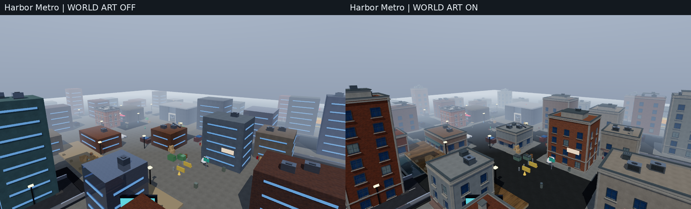
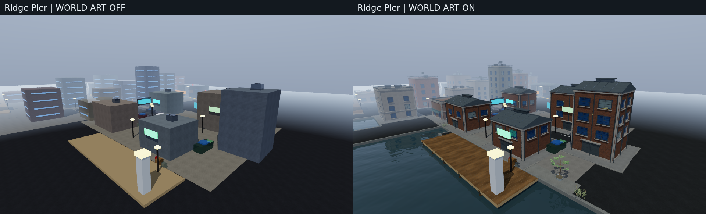
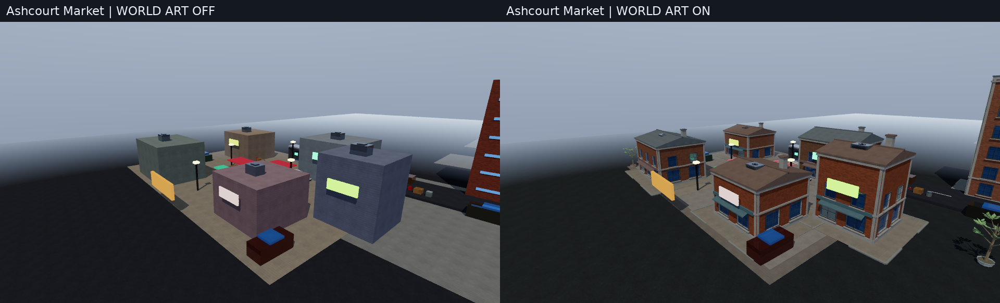
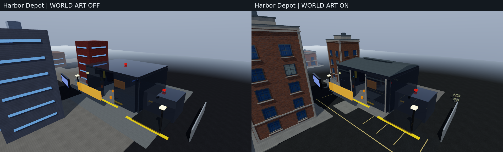
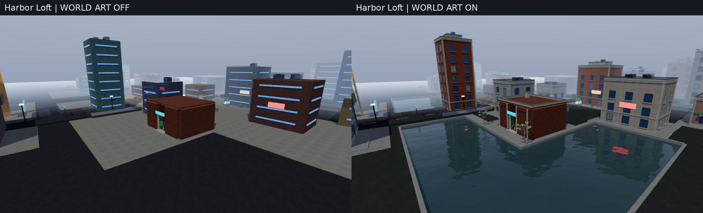
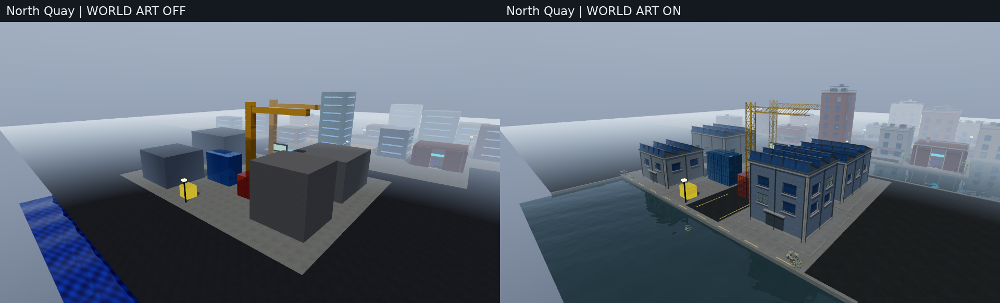
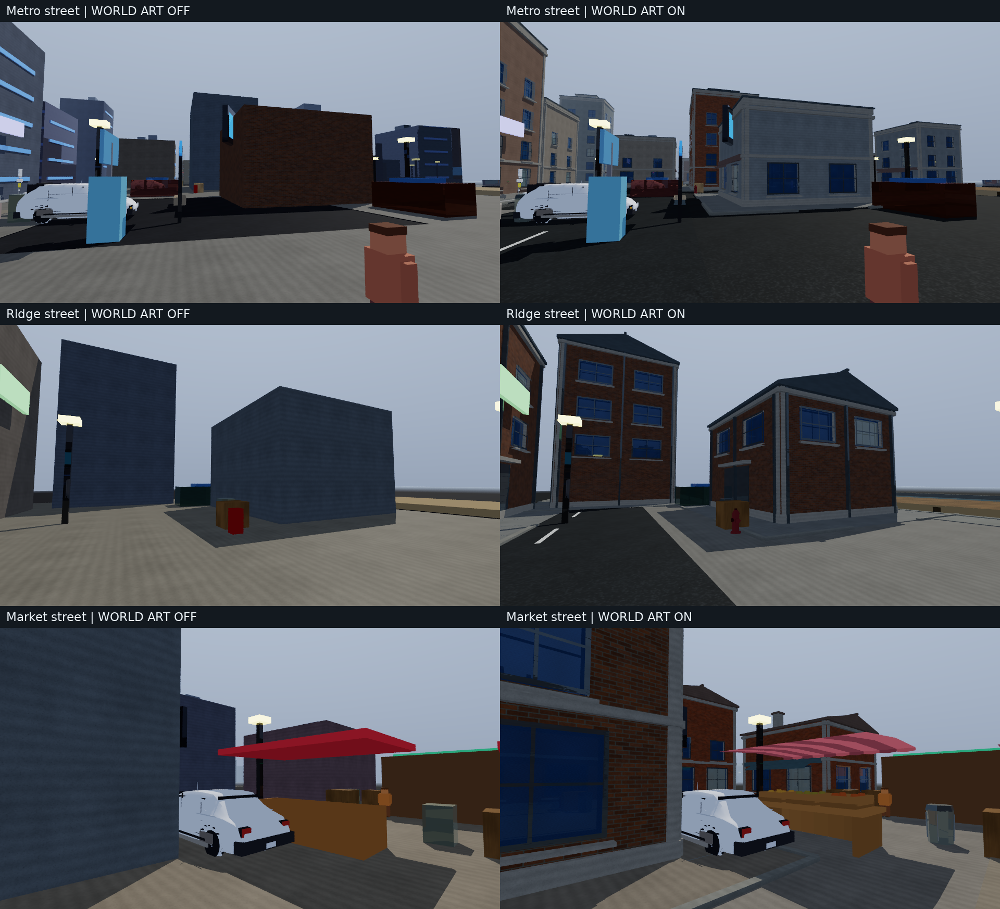
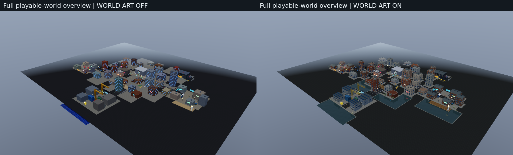
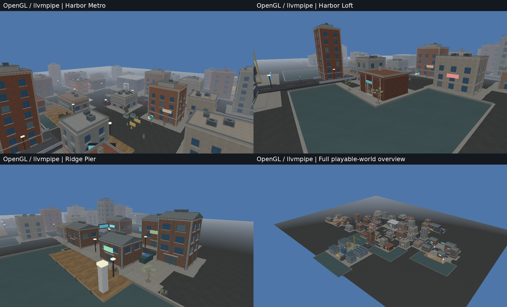

# Full playable-world visual upgrade

This pass expands the earlier `b2442f4` material checkpoint across **all six
playable districts**, rather than another isolated showcase. It adds original
runtime architecture, ground/waterfront geometry, vegetation, prop detail and
water materials. The game remains a playable prototype; the screenshots below
are actual engine output, not offline art renders or generated illustrations.

## Coverage in the real game

| District | Architecture | Plant groups | Ground and waterfront treatment |
|---|---:|---:|---|
| Harbor Metro | 27 shells; existing authored storefront protected | 7 | Frontages, curbs, crossing, lane marks, forecourt and pier |
| Ridge Pier | 5 industrial halls | 4 | Warehouse apron, bridge lanes, board deck and exposed basin |
| Ashcourt Market | 5 shop blocks | 4 | Warm-stone pedestrian spine, perimeter paving and stall detail |
| Harbor Depot | Exterior/roof detailing | 3 | Loading apron, service markings and clear entrance approach |
| Harbor Loft | Exterior/roof detailing | 3 | Retained occupied peninsula, promenade and harbor water |
| North Quay | 4 sawtooth-roof warehouses | 4 | Cargo spine, quay edge, containers, cranes and exposed water |

The real static-world audit reports:

- **41 upgraded decorative shells + 2 landmark exteriors**, with **834 recessed
  window bays** on all four elevations and varied district roof profiles
- **46 frontage walks, 353 curb segments, 96 road markings, 182 pier boards and
  99 waterfront edges**. About **3,611.93 m²** of existing water is genuinely
  exposed after accounting for occupied ground and pier-deck occlusion
- **197 existing prop/plant entities** improved, including 153 utility props,
  30 containers, four crane parts and four market parts
- **25 plant groups**, including all 15 authored planter spheres replaced by
  branched foliage. Their source triangles are matched one-to-one; every other
  authored vertex/triangle and material remains protected
- Three existing water planes share **1,048,572 bytes** of original mipmapped
  color/normal/surface maps, with zero added water geometry

| Static-world metric | Art disabled | Art enabled |
|---|---:|---:|
| Entities | 1,871 | 2,187 |
| Visible mesh instances | 1,859 | 1,981 |
| Visible-instance triangles before runtime distance/LOD selection | 571,428 | 644,432 |
| Unique visible near-mesh triangles | 473,572 | 539,036 |
| Gameplay solids | 329 | 329 |

The net near-detail increase is **73,004 triangles (12.78%)** and 316 entities.
These are static-world construction counts, not a claim that every triangle is
submitted in every camera. NPCs, traffic and later mission content are outside
this construction snapshot and are still present in the actual captures.
Runtime counters vary with view, culling and LOD.

All **1,871 original entity identity/transform/tag/collider records** compare
exactly, and there are **zero added solids**. Original asset files are unchanged.
Source-owned branding, authored maps, mission portals and gameplay identifiers
are retained. [Machine-readable world audit](validation/world-upgrade/world-on.json)
and [comparison summary](validation/world-upgrade/summary.json).

## Actual runtime comparisons

Left is `FURY_WORLD_ART=0`; right is `FURY_WORLD_ART=1`. Both use the **same final
corrected renderer**, the existing surface-detail maps enabled, fixed camera,
lighting/weather/time and resolution. This isolates the art pass; the left side
is not a byte-for-byte execution of the older checkpoint's renderer. In
particular, both sides retain the plane-winding, geometry-culling and dielectric
reflection fixes.

### Harbor Metro



### Ridge Pier



### Ashcourt Market



### Harbor Depot



### Harbor Loft



### North Quay



### Street-level detail and complete-world overview





The overview is an inspection camera: 500 m draw/LOD distance, a 600 m far plane
and extended fog. It intentionally exposes the entire layout and its remaining
empty perimeter; it is not the normal gameplay-performance preset. Street views
retain actual NPCs, vehicles, signs and prototype markers rather than hiding
them for a beauty render.



OpenGL images come from the actual SDL/Mesa llvmpipe backend. That is a software
GPU implementation on this CPU host, not hardware-GPU performance evidence.

## Rendering defects found and corrected

- The giant StreetGrid origin was distance-culled in remote districts even when
  its geometry covered the player. Cached geometry bounds now drive distance,
  sector and LOD decisions, including rotated/mirrored/nonuniform instances.
  CPU-ray/DXR paths retain off-camera shadow/reflection contributors
- Generated paving and the shared `make_plane` helper had triangle winding
  inconsistent with their upward normals. Index orientation is now tested,
  including an actual single-sided horizontal rendered surface
- The original flat ground obscured water. Bounded basins retain building
  foundations, all six fast-travel hubs, bridge corridors and mission approaches;
  exposed quay faces follow the actual land/water boundary
- Tiled water UVs triggered repeated fake shoreline foam in GL. Valid mapped
  water now bypasses legacy color/normal overrides in CPU, GL and DXR paths
- CPU ray mode previously stopped at all opaque nonmetals. Glossy dielectrics
  with roughness <= 0.35 now trace actual Fresnel-weighted reflected geometry.
  Water uses its IOR-derived reflectance; it is not mislabeled metallic to force
  reflections. A bright off-camera target regression proves this capability,
  while rough matte and Direct-debug exits remain bounded

See [architecture](WORLD_ARCHITECTURE.md), [ground/layout](WORLD_GROUND.md),
[vegetation and props](WORLD_LIFE.md), [mapped water](WORLD_WATER.md),
[visibility/culling](WORLD_VISIBILITY.md) and [test methodology](WORLD_TEST_PLAN.md).

## Validation and measured costs

The final source fingerprint is recorded in the machine-readable report along
with executable hashes, every capture hash, exact commands and measured timing.

- **23/23 CTest suites pass** with system SDL and actual offscreen llvmpipe
- Strict GPU-free SDL build: **21 passed, two explicit GL-context skips**, zero
  failures. CPU raster/ray applications do not require a GPU API
- Full-world regression checks real scene coverage, unchanged gameplay fields,
  deterministic geometry/LOD fingerprints, default/disabled modes, invalid
  inputs, byte-identical repeated frozen CPU-ray pixels and bounded workloads
- **44 district captures (22 off/on pairs)** across 11 views: CPU raster and CPU ray, each
  with art off/on at 960×540. Raster uses three frames; ray uses six frames and
  two samples/frame with a two-bounce cap. Five tiny regression captures and a CPU path smoke are
  separate from those 44 images
- Independent architecture/ground/life/visibility/water/audit review and actual
  CPU ray/path regression pass. Focused ASan/UBSan checks pass where run;
  LeakSanitizer is unavailable under this executor's ptrace
- All **eight HLSL entries compile** with checksum-verified official Microsoft
  DXC 1.9.2609.5 using the exact CMake profiles/options. Material ABI remains
  unchanged; shader compilation does not establish Windows/DXR execution

CPU ray **last-frame observations**, 960×540, 2 samples/frame, six accumulated
frames, a two-bounce cap and two workers; identical off/on cameras:

| View | Art off, ms | Art on, ms |
|---|---:|---:|
| Harbor Metro | 1,995.65 | 3,453.46 |
| Ridge Pier | 1,620.75 | 3,472.11 |
| Ashcourt | 1,653.87 | 2,313.60 |
| Depot | 2,931.11 | 3,615.19 |
| Loft | 2,078.28 | 4,186.21 |
| North Quay | 1,412.51 | 3,512.64 |
| Inspection overview | 1,055.94 | 1,543.29 |

The additional geometry and glossy reflections have a real CPU cost. These are
progressive/offline capture settings, not an interactive frame-rate claim.

One separate 640×360 Metro run per case (three frames, one sample/frame) measured:

| Backend | Peak RSS off / on, MiB | Process wall off / on, s |
|---|---:|---:|
| CPU raster | 128.36 / 152.04 | 3.099 / 3.256 |
| CPU ray | 232.88 / 267.69 | 3.724 / 5.414 |

Peak RSS is Linux `wait4` process memory, including startup and loaded assets;
these are single paired observations. [Full memory records](validation/world-upgrade/memory-observations.json).

The capture matrix is deliberately limited to two CPU workers and two available
CPU affinities on a shared 9-CPU/9.7 GiB host. `last_cpu_frame_ms` is the renderer's
**last measured frame**, not a median or a percentile. Process wall times include
startup, asset loading and shutdown and must not be converted into gameplay FPS.
The software rasterizer does not emit the same frame counter, so its timing
records contain process time only. The overview's expanded draw range costs
more than ordinary gameplay views. No real-time AAA frame-rate claim is made.

## Remaining limitations

- Characters, vehicles, several mission props/markers and gameplay/UI systems
  retain their original prototype art. This is a substantial world-wide visual
  pass, not a finished AAA game or a new production art library
- Decorative windows are recessed opaque glazing, not new enterable rooms.
  Plants are modest static geometric urban foliage, without wind, seasons,
  translucency or a scanned tree library. Procedural materials still repeat
- New basins and curbs are visual; original collision and flat-ground movement
  are preserved. There is no new swimming, buoyancy or shoreline-physics system
- CPU ray mode approximates rough indirect light; path mode is more expensive.
  GL uses its existing lighting/reflection approximations, and llvmpipe disables
  the live GL shadow/reflection paths. Images are not promised pixel-identical
- The source baseline reports 1,220 near-zero indexed triangles across referenced
  near/LOD meshes, including 251 exact-zero cross-product results. This pass adds
  none; it does not hide those pre-existing diagnostics. Invalid-index and
  nonfinite vertex/instance counts are zero before and after
- Hosted GitHub Actions had not started when this report was prepared. Windows
  C++/vendor-SDK builds, actual hardware DXR, physical speaker output and a full
  end-to-end mission playthrough remain separate validation gates

## Reproduce

```sh
FURY_SKIP_BUILD=1 FURY_SKIP_CTEST=1 \
FURY_WORLD_WIDTH=960 FURY_WORLD_HEIGHT=540 FURY_WORLD_FRAMES=3 \
FURY_WORLD_RAY_FRAMES=6 FURY_WORLD_RAY_SPP=2 FURY_WORLD_PATH_SMOKE=1 \
  ./scripts/validate-world.sh build out/world-validation

SDL_VIDEODRIVER=offscreen LIBGL_ALWAYS_SOFTWARE=1 \
  ./out/build-system/tests/fury_world_water_tests --gl

FURY_WORLD_ART=1 FURY_TRACE_MODE=ray ./build/apps/vaultline/vaultline \
  --cpu-ray --photo --view loft --no-hud --width 960 --height 540 \
  --spp 2 --frames 6 --capture out/loft.ppm
```

The first command reuses a previously built/tested executable. Omit the two skip
variables to configure, build and run CTest first. Use a GL-capable SDL build for
actual GL validation; a GPU-free SDL build correctly skips unavailable contexts.
