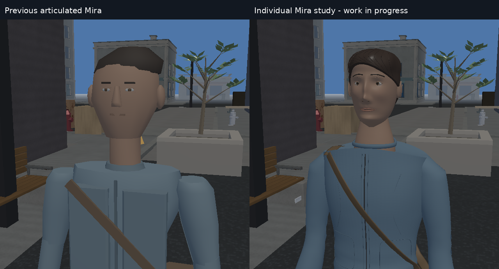

# Mira study: first validated checkpoint

6 October 2026, 09:31 UTC. **Work in progress, not the end of Mira's dedicated
pass and not a claim of GTA VI quality.** The individual session began at 08:37
UTC after restoring the prior published checkpoint and researching references.

Both sides are the actual Vaultline software renderer at the same camera,
lighting, character ID and world position. Left uses the previous articulated
profile; right uses the first individual study. Gameplay/controller corrections
remain active on both sides. Use `FURY_INDIVIDUAL_CHARACTERS=0` to select the prior
articulated assets; `FURY_NPC_DETAIL=0` still selects the earlier box figures.

The study replaces the former head and garment primitives with a connected
facial surface, wrapping lids, formed lips/nostrils/ears, tapered fingers,
constructed jacket/bag and a continuous rear hair mass. Original per-surface
maps distinguish skin, cloth, eyes, leather, rubber and hardware. Valid atlas
mip chains are now preserved in OpenGL; a per-entity distance threshold keeps
Mira's close mesh inside twelve meters, using the real geometry-bound rule.

The first raw renders exposed invalid curve endpoints, a hair/skull intersection,
excessive eye projection, horizontal face interpolation bands, squared sleeve
caps and a floating strap. Those were corrected and rendered again. Remaining
visible problems include doll-like anatomy/material response, fine seam/hair
aliasing, and a neck that still needs anatomical refinement. The next iteration
is investigating verified CC0 human topology; no proprietary Rockstar or other
reference assets are imported into the game.

Verification at this checkpoint: **36/36 CTest suites pass**, including real
OpenGL llvmpipe tests, production gameplay regressions, full runtime comparisons,
and new atlas/LOD/profile suites. The individual profile passes 1,188 deformed
poses at three heights and both LODs; 192 generic fallback cases remain byte-exact.
Near/far budgets are 39,662 / 9,344 triangles. These numerical checks do not
substitute for pixel critique or certify final visual quality.

[Test output](../../validation/characters/mira/checkpoint-01-tests.txt) ·
[Work log](WORK_LOG.md) · [Geometry review](GEOMETRY_REVIEW.md) ·
[Diagnostic stage, explicitly separate from gameplay](../../CHARACTER_REVIEW_STAGE.md)

Reference images were inspected privately and are not redistributed in Fury.
Sources: [official Rockstar screenshots](https://www.rockstargames.com/VI/media/screenshots),
[Sorici's eye/hair construction](https://marmoset.co/posts/how-to-create-realistic-hair-peach-fuzz-and-eyes/),
[Jethani's skin discussion](https://marmoset.co/posts/creating-realistic-skin-toolbag-saurabh-jethani/),
[Bidou's multi-view sculpt](https://ocnbidou.artstation.com/projects/0OPwE), and
[Widelski's clothing construction](https://marmoset.co/posts/rendering-realistic-clothing-and-armor-materials-in-toolbag/).
